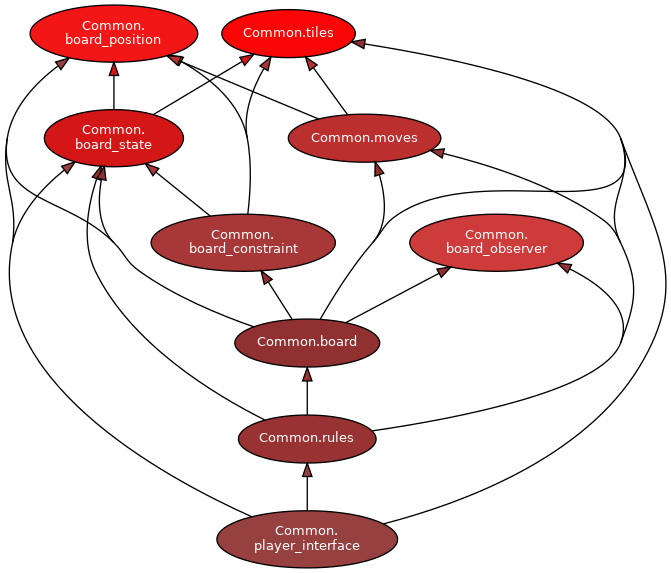
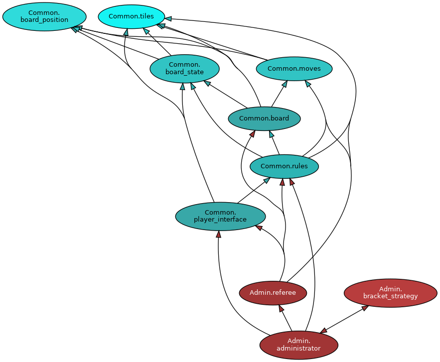
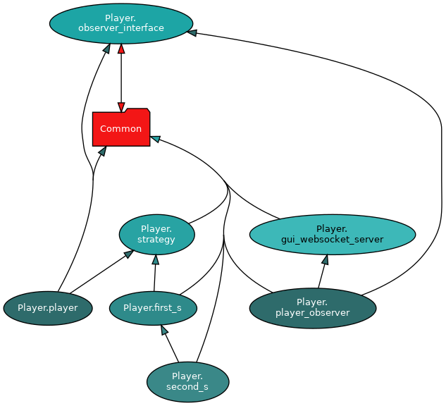

# Tsuro

This directory holds an in progress implementation of a project to administer Tsuro tournaments. 

### Directory Layout

`Planning/` holds the project planning documentation

`Common/` holds the code shared between all of the components of a Tsuro tournament

`Player/` holds the code for automated Tsuro players

`Admin/` holds the code for administering a Tsuro game or tournament

`Remote/` holds the code for servers and clients for a distributed game

`TestHarnesses/` holds the code for test harnesses

`Static/` holds static files

### Navigation

The core code for Tsuro lives in `Common/`, `Player/` and `Admin/`. All source files have a module docstring at the top of the file describing the purpose of the module. 

Common is meant to hold all code that is shared between Tsuro game and tournament administrators and players. Within Common, the below diagram represents the static dependencies of the modules:



Admin is meant to hold the code dedicated to running a Tsuro game and a Tsuro tournament. This code is not meant to be shared with Players. Within Admin, the below diagram represents the static dependencies of the modules:



Player is meant to hold the interfaces and code for players competing in Tsuro games and tournaments. Within Player, the below diagram represents the static dependencies of the modules:



Note that in all of the above diagrams, there are very few bidirectional dependencies. For example, the tile module holds all of the code associated with building, processing, and rendering tiles. The tile module does not depend on anything to do with boards since all boards depend on the tile module. In addition, note that there are no dependencies between `Player` and `Admin` since those are meant to be separate components of this Tsuro system. 

Note: The above diagrams exclude some small modules that hold constants and simple utility functions in order to make the graphs easier to understand. 

#### Dynamic Dependencies and Core Components

The core classes and modules inside of the Common directory are:

1. `Common.result`: A result type for Python
    * This is a highly recommended place to start and the file contains a lot of information on our result type
1. `Common.tiles`: All tile rendering, generating, and manipulating code
    * `enum Port`: Represents the different ports on a tile
    * `class Tile`: Represents a tile and how to operate on a tile. Stores edges as a list of tuples going from port to port
1. `Common.board_position`: Contains the `BoardPosition` class which defines how positions are referred to on a Tsuro board
1. `Common.board_state`: All code that deals with handling an immutable board state 
    * `class BoardState`: Represents an immutable board state that is meant to be shared with untrusted functionality that should not be allowed to mutate the board state. Stores a mapping from board position to tiles and a mapping from player avatars (represented as a `ColorString`) to their position and port. 
1. `Common.moves`: The dataclasses used to represent Tsuro moves
1. `Common.board_constraint`: A static class used to check whether moves validate physical constraints of Tsuro boards
1. `Common.board`: All code that deals with mutating board states
    * `class Board`: A wrapper around immutable board states that adds all of the functionality needed to run a Tsuro game via methods that evolve the contained board state. Does not handle tiles or ports directly and relies heavily on the BoardState class
1. `Common.rules`: All code that deals with checking legality of moves
    * `class RuleChecker`: A Tsuro rule checker that validates the legality of moves. Depends on the given board state and a constructed board to attempt to play moves and observe the results of the simulated moves. 
1. `Common.player_interface`: The interface for players playing in Tsuro games

The core classes and modules inside of the Player directory are:

1. `Player.strategy`: An interface for player strategies which are isolated pieces of code to calculate Tsuro moves. Calculates moves based off of the given board state and rule checker. 
1. `Player.first_s`: A very simplistic strategy as described in Assignment 6
1. `Player.second_s`: A somewhat more complex strategy as described in Assignment 7
1. `Player.Player`: An implementation of the player interface in Common that wraps a strategy and calls the correct observer methods
1. `Player.observer_interface`: An interface for observing players
1. `Player.player_observer`: A player observer that renders the game to a user's browser

The core classes and modules inside of the Admin directory are:

1. `Admin.referee`: A referee is in charge of running a single Tsuro game with 3-5 players. A referee uses a board and a list of provided players in order to run the game. 
1. `Admin.bracket_strategy`
    * `class BracketStrategy`: An interface for determining how to split players and eliminate players in a Tsuro tournament
    * `class SimpleBracketStrategy`: An implementation of a simple bracket strategy as described in assignment 7
1. `Admin.administrator`: An implementation of a Tsuro administrator capable of running a Tsuro tournament with many local players. Runs many games as defined by the bracket strategy and returns the winners of the tournament. 

### GUI

The GUI rendering code is done via a mix of SVGs, HTML, CSS, and Javascript. 

An individual tile is rendered to an SVG image by the `Tile.to_svg()` method. Note that a tile must be passed the avatars that are on the tile so that the SVG can include the avatars placed on the correct ports. Collided avatars are rendered as an avatar that blinks between the colors of every collided avatar. 

A board state is responsible for rendering the state of a board including all placed tiles and avatars. This is done via by the `BoardState.to_html()` method which returns HTML that lays out all of the tiles in one HTML page. 

An entire game can be rendered from the perspective of a player via the `GraphicalPlayerObserver` in the Player package. The graphical player observer renders each board update to an HTML file that is opened in the user's browser. The user's browser is triggered to reload after each update via a message sent over a websocket (see `GraphicalPlayerObserver` and `Player.gui_websocket_server` for more information on this).

### Distributed System

The code for the distributed portion of the game lives in `Remote/`.

There is a server that constructs an administrator to run a tournament and accepts TCP connections from clients who want to participate in the tournament. The remote proxy pattern is used for communication between players and the game through a RemotePlayer and a RemoteAdmin.  

To start the server and clients, see [startup.md](./Remote/startup.md)

The protocol for the communication messages can be found in [remote.md](./Planning/remote.md)

### Symlinks

Note that a number of the assignments required files to have dashes in their names. Since python does not support importing from files with dashes in their names, we symlinked all dashed filenames to the equivalent filenames but with underscores. The dashed files are purely there to satisfy the assignment while the underscored symlinks are actually imported and used from the rest of the codebase. 

While it is possible to use importlib, runpy, or any other number of methods to import code from arbitrary locations, doing so does not allow mypy to detect and evaluate the import. Due to our heavy usage of a strict mypy config, these solutions were not adequate for our codebase. 

### Third Party Dependencies

Tsuro dependencies are in the `requirements.txt` file. In order to install the dependencies, simply run `make`. 

### Testing

To run all of the tests, run:

```
make
./test.sh
```

In addition, there is a limited amount of fuzzing based code available. To run the fuzzers, run:

```
make
./fuzz.sh
```

Inside of the codebase, all files are accompanied by a file containing unit tests. For example, `player.py` holds a player implemenation and `player_test.py` holds the unit tests for the player. 

### Pre-commit Hooks

It is required to use pre-commit hooks when contributing to this project. Pre-commit hooks are managed using [`pre-commit`](https://pre-commit.com/) and can be installed by running `pre-commit install`. The currently configured pre-commit hooks are:

* mypy
    * This pre-commit hook enforces that all committed code passes mypy's type checker with a very strict mypy config. This is used to minimize the change of bugs arising from type errors. Mypy is configured to be strict inside of the pre-commit config file and is further configured in `mypy.ini`. 
* pylint
    * Pylint is a python linter. It is configured in our `pylintrc` file. This is used to enforce a variety of code quality conventions across the codebase. 
* black
    * Black is a python formatter. Black ensures that all python code is formatted in an opinionated and consistent manner. Note that black has no config options. 
* isort (and seed-isort-config)
    * Isort is an automatic import sorter for python that sorts imports at the top of the file into three chunks: standard library, third party, and first party. The `.isort.cfg` file configures which imports are treated as first v/s third party and seed-isort-config seeds that config in a reasonable manner. 

### Network Mode

In order to ensure that this project can be easily adapted to run in a network context, the use of mutation (especially across important boundaries) is minimized. All data flows are done via function calls that take in data and return data (without mutating the input data). This means that it should be relatively easy to adapt this project to run over the network via creating network adapter classes. For example, one could create a `NetworkPlayer` class that adheres to the `Player` interface but uses the `NetworkJSONStream` to send serialized messages over the network to a remote player. `Common/util.py` also has some potentially helpful code for setting timeouts on arbitrary python code. 
